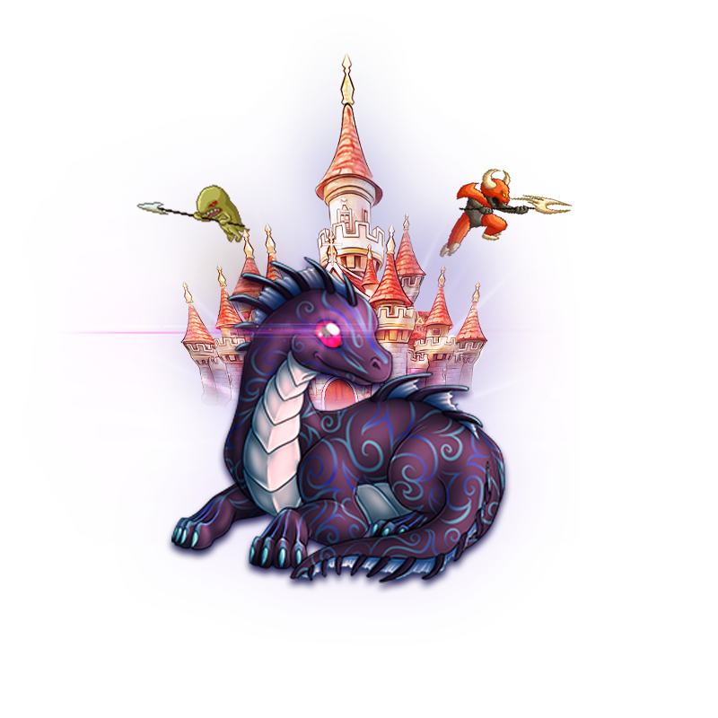

<div align="center">

  

  # 🐉 SNAP DRAGON
  ### *Roguelite Tower Defense & Action Arena*

  [](https://developer.mozilla.org/en-US/docs/Web/HTML)
  [](https://developer.mozilla.org/en-US/docs/Web/CSS)
  [](https://developer.mozilla.org/en-US/docs/Web/JavaScript)
  [](LICENSE)
  []()

  <p align="center">
    <strong>Defend your fortress against hordes of monsters, unleash devastating elemental magic, acquire Roguelite perks, and compete on the multiplayer leaderboard!</strong>
  </p>
  
  <br/>

</div>

---

## 📖 Table of Contents
- [🌟 Game Overview](#-game-overview)
- [⚔️ Hero Classes & Traits](#️-hero-classes--traits)
- [🔮 Spells & Weapon Arsenal](#-spells--weapon-arsenal)
- [🃏 Roguelite Perk System](#-roguelite-perk-system)
- [🌲 Realms & Castle Designs](#-realms--castle-designs)
- [👹 Monsters & Bosses](#-monsters--bosses)
- [📊 Multiplayer Leaderboard](#-multiplayer-leaderboard)
- [🎮 Game Controls](#-game-controls)
- [🛠️ Tech Stack & Architecture](#️-tech-stack--architecture)
- [🚀 Quick Start & Installation](#-quick-start--installation)

---

## 🌟 Game Overview

**Snap Dragon** evolves the classic arcade monster clicker into a feature-packed **Roguelite Tower Defense & Action Game**. Enemies march across 5 distinct realms toward your castle. Your objective is to command your Hero, fire rapid arrow volleys, cast tactical elemental spells, upgrade castle defenses, and survive 20 waves including epic Boss encounters!

---

## ⚔️ Hero Classes & Traits

Choose your Hero Class before entering battle to gain unique tactical advantages:

| Class | Icon | Specialty | Class Perks |
| :--- | :---: | :--- | :--- |
| **Archer** | 🏹 | Precision Marksman | +25% Critical Hit Chance |
| **Mage** | 🧙 | Spellmaster | +30% Spell Damage & +25% Cooldown Haste |
| **Warrior** | 🛡️ | Citadel Warden | +50 Max Castle HP & 20% Damage Reduction Armor |
| **Engineer** | ⚙️ | Master Inventor | +40% Gold Generation from Slain Enemies |

---

## 🔮 Spells & Weapon Arsenal

Hot-key between your primary weapon and 4 elemental spells to wipe out enemy waves:

```
[1] 🏹 ARROW ATTACK    ➜ Fast point & click projectile with tracer FX and impact sparks
[2] 🔥 FIREBALL        ➜ AoE explosion dealing 85 Damage in a 180px splash radius
[3] ⚡ CHAIN LIGHTNING ➜ Electric arc dealing 130 Damage across up to 3 targets
[4] ❄️ ICE FREEZE     ➜ Frozen frost blast that stuns all on-screen monsters for 4s
[5] 💥 METEOR STRIKE   ➜ Tactical nuke unleashing 280 Damage across the entire field
```

---

## 🃏 Roguelite Perk System

Every **3 Waves** (Waves 3, 6, 9, 12, 15, 18), the game pauses to present a **3-Card Roguelite Choice**:

<div align="center">

| Card | Title | Effect |
| :---: | :--- | :--- |
| 🔥 | **Pyro Essence** | +30% Spell Damage across all spells |
| ⚡ | **Time Warp** | -25% Spell Cooldown Durations |
| ❤️ | **Stone Citadel** | +60 Max Castle HP & Full Health Restoration |
| 🎯 | **Deadly Focus** | +20% Crit Chance & 3x Critical Hit Damage |
| 💰 | **Greed Ring** | +50% Gold Rewards from all slain monsters |
| ❄️ | **Permafrost** | Increases Freeze Duration by +50% |
| 🛡️ | **Iron Plating** | Castle takes 25% less damage from enemy attacks |

</div>

---

## 🌲 Realms & Castle Designs

Battle across 5 immersive environments, featuring area-matched castle graphics and dynamic ambient glowing auras:

- 🌲 **Ancient Forest** — Nature Green Emerald Castle Aura
- 🏜️ **Sunken Desert** — Sun Gold Desert Castle Aura
- ❄️ **Frost Citadel** — Cyan Crystal Ice Castle Aura
- 🌋 **Volcanic Ridge** — Crimson Magma Heat Castle Aura
- 🐉 **Dragon's Lair** — Deep Purple Arcane Magic Castle Aura

---

## 👹 Monsters & Bosses

| Enemy | Class Name | Base HP | Speed | Damage | Description |
| :--- | :--- | :---: | :---: | :---: | :--- |
| **Goblin** | `charactor1` | 25 | Fast | 6 | Nimble swarm units |
| **Orc** | `charactor2` | 75 | Normal | 14 | Heavy shock troops |
| **Specter** | `charactor3` | 45 | Very Fast | 10 | Ethereal fast runner |
| **Gargoyle** | `charactor4` | 140 | Slow | 22 | Armored castle batterer |
| **Dragon King** | `charactor5` | 450 | Boss Speed | 45 | Mighty Boss spawning on Wave 5, 10, 15, 20 |

---

## 📊 Multiplayer Leaderboard

- **Player Name Input**: Enter your custom Hero Name on the main menu.
- **Real Score Tracking**: Saves actual playthrough metrics (`Player Name`, `Final Score`, `Wave Reached`, `Monsters Slain`, `Hero Class`, `Difficulty`, `Date`) to local storage.
- **Ranked Board**: Opens from the main menu or post-game modal, highlighting your active hero profile with a `(YOU)` badge.

---

## 🎮 Game Controls

| Key / Input | Action |
| :--- | :--- |
| **Left Click** | Shoot Arrow / Target Monster / Cast Selected Spell |
| **Keys 1 - 5** | Quick Switch Weapons & Spells |
| **P / ESC / Space** | Toggle Game Pause Menu |
| **P (in pause)** | Access Castle Upgrade Shop |

---

## 🛠️ Tech Stack & Architecture

```
SnapDragon/
├── index.html           # Main Menu, Hero Selection, Leaderboard & Achievements
├── style.css            # Dark Theme Glassmorphism & UI Component Styling
├── home.html            # Main Gameplay HUD, Canvas Overlay, Spells & Modals
├── home-style.css       # Scaled Castle Auras, Spell Bar, & Pause Menu CSS
├── script.js            # Engine Core: Game State, Movement, Spells, Canvas FX & Storage
├── images/              # Real Backgrounds, Castles, Monsters, and UI Buttons
└── sounds/              # Audio Effects & Background Music
```

- **Core**: Vanilla HTML5, CSS3 (Glassmorphism & Keyframe Animations), Pure JavaScript (ES6+).
- **Canvas FX**: Custom 2D Particle System for arrow trajectories, fire explosions, lightning arcs, and meteor strikes.
- **Persistence**: `localStorage` API for real leaderboard entries, unlocked achievements, and sound preferences.

---

## 🚀 Quick Start & Installation

No complex build setup required! Play directly in any modern web browser:

1. **Clone the Repository**:
   ```bash
   git clone https://github.com/dulanjayabhanu/SnapDragon.git
   cd SnapDragon
   ```

2. **Launch a Local Server**:
   ```bash
   python -m http.server 8080
   ```

3. **Play**: Open `http://localhost:8080/index.html` in your browser.

---

<div align="center">
  <sub>Built with ❤️ for Snap Dragon. Protect your Castle & Conquer the Leaderboard! 🏰🔥</sub>
</div>
